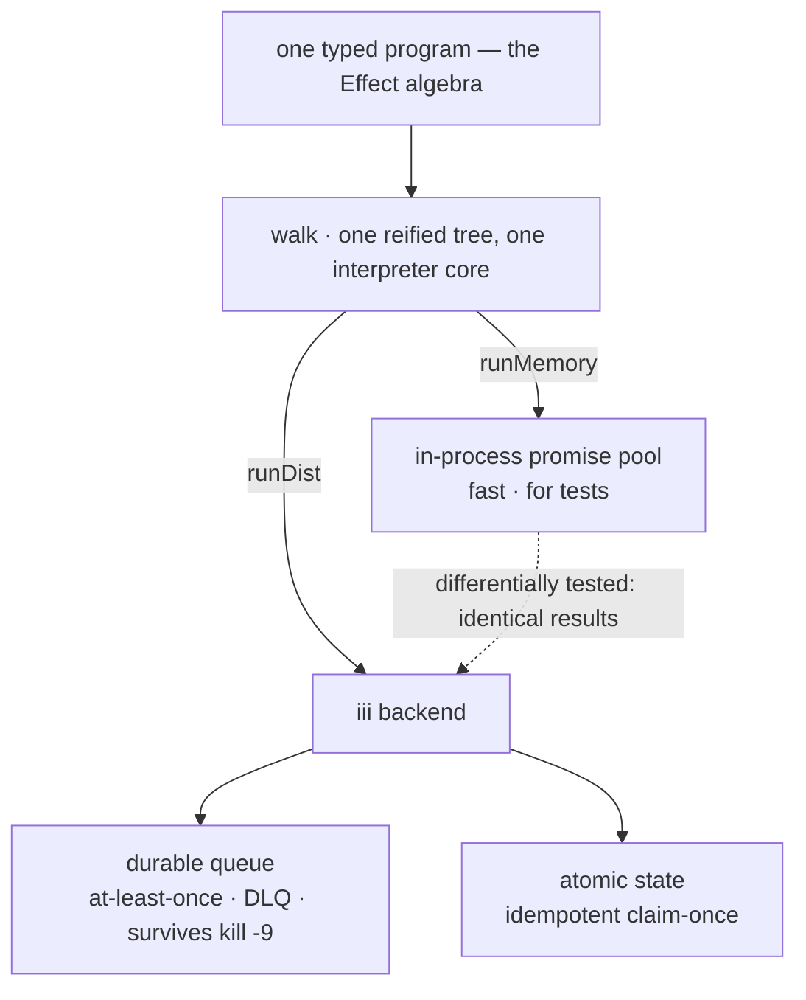

# agentfx

**A small typed effect system whose production interpreter is a durable distributed runtime.**

You write one typed program from a tiny algebra. A *reference* interpreter (`runMemory`) runs
it in-process — great for tests. A *distributing* interpreter (`runDist`) runs the same program
on [iii](https://iii.dev): an at-least-once durable queue with atomic state, so it survives
process death. The two are differentially tested.



The thesis in a line: **a typed effect algebra on top, a durable runtime underneath, and the
boundary between "elegant" and "durable" is the interpreter** — a fan-out that survives a
`kill -9`, which a pure in-memory `Observable` never could.

> **Status: a working spike**, not production. The example "LLM" is a `setTimeout` and tasks are
> `toUpperCase`/`length` — the point is the control plane + the lowering, not inference. See
> **Limits** for exactly what's real.

---

## Two type laws (enforced by the compiler)

Checked by `tsc` in [`src/laws.ts`](src/laws.ts) via `@ts-expect-error` — if a guard stopped
firing, the build would fail.

**1. You cannot `retry` a non-idempotent effect** (the cold-resubscribe / double-charge footgun
is a *compile error*). Only `task(...)` mints the `Replayable` brand; `flatMap` strips it.

```ts
retry(charge.effect({ amt: 10 }), 3); // ✓ a task is Replayable
retry(succeed(5), 3);                 // ✗ compile error: not Replayable
```

**2. You cannot run an effect without supplying its capabilities** `R`; `provide` rejects keys
that aren't required.

```ts
runMemory(prog, { llm, db }); // ✓
runMemory(prog, { llm });     // ✗ compile error: missing `db`
```

## One program, two interpreters

```ts
import { flatMap, forEachTask, map, runMemory, runDist, makeIIIBackend } from "agentfx";

const program = flatMap(
  forEachTask(items, upper, 3),                              // type-safe distributable fan-out
  (uppers) => map(forEachTask(uppers, lengthOf, 2),
                  (lens) => ({ uppers, totalLen: lens.reduce((a, b) => a + b, 0) })),
);

await runMemory(program, {});                  // in-process promise pool — instant, for tests
await runDist(program, {}, makeIIIBackend());  // iii: durable queue — crash-surviving
```

[`ex-differential.ts`](src/ex-differential.ts) runs both on the same program: the happy path is
byte-identical, and a throwing task surfaces a typed `fail()` under **both** (no hang, no
unhandled rejection — the error *shapes* differ by design: `runMemory` returns the raw cause,
`runDist` an aggregated batch error). [`ex-durability.ts`](src/ex-durability.ts) survives an
executor `kill -9` mid-batch.

## The algebra

| combinator | meaning |
|---|---|
| `succeed` / `failWith` | pure success / typed failure |
| `flatMap` / `map` | sequence (unions `R` and `E`; strips `Replayable`) |
| `catchAll(e, h)` | recover from a typed failure with another effect |
| `retry(e, n)` | re-run — **requires `Replayable`** |
| `provide(e, layer)` | discharge capabilities from `R` |
| `task(fnId, keyOf, impl)` | a distributable, idempotent unit; `impl` gets a `TaskCtx.idempotencyKey` |
| `forEachTask(items, task, n)` | type-safe distributable fan-out (children guaranteed `Remote`) |
| `forEachPar(items, f, n)` | generic fan-out; **`runDist` requires `task` children** (closures don't serialize → it throws) |

## How `runDist` lowers to iii

| node | `runMemory` | `runDist` (iii) |
|---|---|---|
| `task().effect()` standalone | local impl | **direct `w.trigger`** (a non-durable RPC) |
| `forEachTask` / `Par` of tasks | promise pool, concurrency `n` | durable queue: wave-throttled to `n`, at-least-once, crash-surviving, failures surfaced |
| `retry` | loop | loop (each attempt re-runs the child) |
| `flatMap` / `map` / `catchAll` / `provide` | in-process | in-process (driver) |

> Preemption (`switchMap` → an atomic *epoch fence*, so only the latest input's tool fires) is a
> **separate stream-level lowering** in [`src/demo.ts`](src/demo.ts) + [`src/iii.ts`](src/iii.ts),
> not an `Effect` combinator. Run it with `npm run preempt`.

## Run it

```bash
npm install
# start an iii engine with iii-state + iii-queue workers:  iii --config config.yaml
npm run executor       # terminal A: registers tasks + the batch subscriber (stays running)
npm run differential   # terminal B: happy path identical + failure path surfaced
npm run durability     # terminal B: fans out 12 tasks — now `pkill -9 -f ex-executor` in
                       #             terminal A mid-run; redelivery still finishes all 12
npm run typecheck      # the type laws are the test
```

## Design notes

- **Reified, not final.** `Effect<R,E,A>` is a tagged-union *data* tree, so interpreters can
  walk it. TS has no GADTs, so the tree erases intermediate types (`FlatMap`/`Par`/`CatchAll`);
  that erasure is contained to the constructors in `effect.ts`. (This is why Effect-TS chose
  fibers/tagless-final — the trade-off is real and named.)
- **Closures don't distribute.** `runDist` only fans out `task` effects (a registered `fnId` +
  serializable args), never arbitrary closures — same reason RPC can't ship a lambda.
- **Backend is pluggable.** `runDist` targets a `Backend` interface; `runtime-iii.ts` is one
  implementation. The algebra doesn't know about iii.

## Limits (honest)

- Example tasks are pure; the "LLM" is a timer. Wire a real model into a `task` and it works.
- **Durability is across consumer crashes** (the engine holds messages, redelivers on restart).
  The default iii `builtin` broker is in-memory, so it is **not** durable across an *engine*
  restart — that needs a persistent queue adapter.
- **At-least-once, not exactly-once.** A crash *after* a side effect but *before* its result is
  recorded re-runs the task on redelivery. `task` impls get `ctx.idempotencyKey` precisely so a
  real side-effecting impl can dedupe at its provider; pure tasks need nothing.
- A standalone `task().effect()` under `runDist` is a **direct (non-durable) call**; durability
  applies to `forEachTask`/`Par` batches.
- The preemption fence's correctness depends on the iii engine's `state::update` being
  linearizable and returning a consistent atomic pre-image; demonstrated, not formally verified.

## License

MIT — see [LICENSE](LICENSE).
