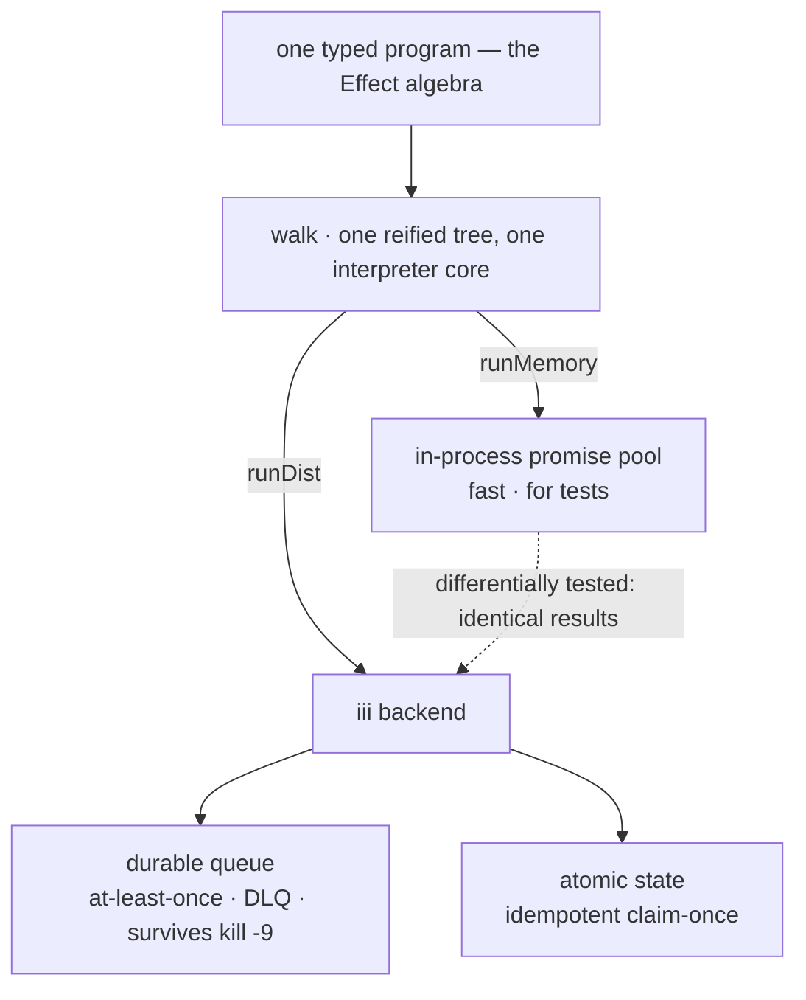

# agentfx

**A small typed effect system whose production interpreter is a durable distributed runtime.**

You write one typed program from a tiny algebra. A *reference* interpreter (`runMemory`) runs
it in-process — great for tests. A *distributing* interpreter (`runDist`) runs the same program
on [iii](https://iii.dev): an at-least-once durable queue with atomic state, so it survives
process death. The two are differentially tested.



The thesis in a line: **a typed effect algebra on top, a durable runtime underneath, and the
boundary between "elegant" and "durable" is the interpreter** — a fan-out that survives a
`kill -9`, which a pure in-memory `Observable` never could.

> **Status: a working spike**, not production. The example "LLM" is a `setTimeout` and tasks are
> `toUpperCase`/`length` — the point is the control plane + the lowering, not inference. See
> **Limits** for exactly what's real.

---

## Two type laws (enforced by the compiler)

Checked by `tsc` in [`src/laws.ts`](src/laws.ts) via `@ts-expect-error` — if a guard stopped
firing, the build would fail.

**1. You cannot `retry` a non-idempotent effect** (the cold-resubscribe / double-charge footgun
is a *compile error*). Only `task(...)` mints the `Replayable` brand; `flatMap` strips it.

```ts
retry(charge.effect({ amt: 10 }), 3); // ✓ a task is Replayable
retry(succeed(5), 3);                 // ✗ compile error: not Replayable
```

**2. You cannot run an effect without supplying its capabilities** `R`; `provide` rejects keys
that aren't required.

```ts
runMemory(prog, { llm, db }); // ✓
runMemory(prog, { llm });     // ✗ compile error: missing `db`
```

## One program, two interpreters

```ts
import { flatMap, forEachTask, map, runMemory, runDist, makeIIIBackend } from "agentfx";

const program = flatMap(
  forEachTask(items, upper, 3),                              // type-safe distributable fan-out
  (uppers) => map(forEachTask(uppers, lengthOf, 2),
                  (lens) => ({ uppers, totalLen: lens.reduce((a, b) => a + b, 0) })),
);

await runMemory(program, {});                  // in-process promise pool — instant, for tests
await runDist(program, {}, makeIIIBackend());  // iii: durable queue — crash-surviving
```

[`ex-differential.ts`](src/ex-differential.ts) runs both on the same program: the happy path is
byte-identical, and a throwing task surfaces a typed `fail()` under **both** (no hang, no
unhandled rejection — the error *shapes* differ by design: `runMemory` returns the raw cause,
`runDist` an aggregated batch error). [`ex-durability.ts`](src/ex-durability.ts) survives an
executor `kill -9` mid-batch.

## The algebra

| combinator | meaning |
|---|---|
| `succeed` / `failWith` | pure success / typed failure |
| `flatMap` / `map` | sequence (unions `R` and `E`; strips `Replayable`) |
| `catchAll(e, h)` | recover from a typed failure with another effect |
| `retry(e, n)` | re-run — **requires `Replayable`** |
| `provide(e, layer)` | discharge capabilities from `R` |
| `task(fnId, keyOf, impl)` | a distributable, idempotent unit; `impl` gets a `TaskCtx.idempotencyKey` |
| `forEachTask(items, task, n)` | type-safe distributable fan-out (children guaranteed `Remote`) |
| `forEachPar(items, f, n)` | generic fan-out; **`runDist` requires `task` children** (closures don't serialize → it throws) |

## Typing the wire (optional): `schemaTask`

The cross-worker boundary is stringly-typed by default. `schemaTask` closes that with one
[zod](https://zod.dev) schema that becomes three things at once:

- **static types** — `In`/`Out` are inferred via `z.infer`, so callers are compile-time checked
- **a published JSON Schema** — sent to the engine as `request_format`/`response_format`; read it
  back with `iii trigger engine::functions::info --json '{"function_id":"agentfx::greet"}'`
  (discoverable by the console and LLM tool-use)
- **runtime validation** — a bad payload is rejected at the executor and rides the `fail()`
  channel as a `ZodError`

```ts
const greet = schemaTask(
  "agentfx::greet",
  { input: z.object({ name: z.string().min(1), times: z.number().int().min(1).max(5) }),
    output: z.string() },
  async ({ name, times }) => Array.from({ length: times }, () => `hi ${name}`).join(" "),
);

greet.effect({ name: "ada", times: 3 });       // ✓ typed
greet.effect({ name: "ada", times: "lots" });  // ✗ compile error (inferred from the schema)
```

`npm run schema` runs it live. (Caveat: the engine stores the schema under `request_schema` in
`functions::info`; the `iii trigger <fn> --help` view doesn't surface it yet — a CLI display gap.)

A contract violation is just a typed failure, so `catchAll` recovers it into a branch —
`catchAll(parseAmount.effect(s), () => succeed(0))` turns a bad parse into a fallback,
identically under both interpreters (`npm run catch`). The recovered value matches across
backends; the raw error *shape* differs by design (structured `ZodError` in-process, a message
string over the wire).

## Types from other workers' contracts (any language)

`schemaTask` types the surface *you* author. But you also call functions implemented by *other*
workers — maybe in Python or Rust. Those workers declare their own contracts
(`request_format`/`response_format`), which the engine stores. `npm run gen` walks the live
registry and writes `src/contracts.generated.ts` — a typed `Contracts` map of every declared
function, regardless of language. `remote(fnId)` is statically typed from it:

```ts
// pymath::add is implemented in PYTHON (pymath_worker.py); its contract is declared there.
const r = await runDist(remote("pymath::add")({ a: 2, b: 3 }), {}, be);
//        remote("pymath::add") : (input: { a: number; b: number }) => Effect<…, { sum: number }>
//        r.value is typed { sum: number } — derived from the Python worker, not hand-written.

remote("pymath::add")({ a: 1, b: "two" }); // ✗ compile error (b: number, from the Python contract)
```

The engine is the IDL: a worker's contract flows to the consumer in *its* preferred typed
language. That's the polyglot-substrate property made concrete — you work in TypeScript and
still call anything in any language, type-safe. `npm run gen` regenerates against whatever's
running. (`remote()` calls run under `runDist` only — there's no in-process impl for another
worker's function.)

## A real agent (Claude + a polyglot tool)

The point of all the machinery: a real LLM agent whose tools are iii workers — in any language —
with durable, preemptible turn semantics. `ex-agent.ts` runs Claude (`claude-opus-4-8`) in a ReAct
loop whose `add` tool is the **Python** `pymath::add` worker, invoked through the typed `remote()`
client:

```
Claude → tool call `add` → remote("pymath::add") → runDist → iii engine → Python worker → result
```

```bash
npm run agent          # "what is 21 + 21, then add 100?" → calls the Python tool twice → 142
npm run preempt-agent  # a new message mid-turn preempts the in-flight turn
```

`ex-preempt-agent.ts` answers the question this repo kept circling: **does preemption compose with
a real, multi-step LLM turn?** A new user message arrives mid-turn; the in-flight inference is
aborted (soft — saves tokens) and every tool call is gated on the epoch fence (hard). Result: only
the latest message's tool fires; the superseded turn is fenced out. The fence sits at the tool
boundary, so it holds regardless of how long or variable the real inference is.

Needs `ANTHROPIC_API_KEY` (and optional `ANTHROPIC_BASE_URL`) plus the `pymath` worker running
(`python pymath_worker.py`). The model call is non-streaming with adaptive thinking and an
`AbortSignal` for preemption.

## A durable agent loop (aios-style) — the loop IS the queue

`ex-agent.ts` above runs the ReAct loop **in the driver** — a normal `for`-loop in one process.
Kill that process mid-turn and the turn is gone. [`src/harness/`](src/harness/) re-expresses it the
way [aios](https://github.com/eumemic/aios) does: **there is no loop.** An append-only event log is
the source of truth, a step function is re-entered by durable wake jobs, and a driver crash mid-turn
resumes from the log. The agent's reasoning loop itself is durable.

| aios concept | here, on agentfx + iii |
|---|---|
| append-only session event log | per-event keys in file-backed `iii-state` ([`log.ts`](src/harness/log.ts)); monotonic seq via atomic `state::update increment` |
| the "loop" is a job queue re-entering a step | `wake` jobs on the iii durable queue → `agentfx::harness::step` ([`worker.ts`](src/harness/worker.ts), [`step.ts`](src/harness/step.ts)) |
| `reacting_to` watermark; status derived from the log | [`sweep.ts`](src/harness/sweep.ts): `needsInference` = ∃ stimulus with `seq >` the max assistant `reacting_to`. No status column. |
| every tool is async; the model stays responsive | tools are fire-and-forget durable-queue jobs ([`tools.ts`](src/harness/tools.ts)); the step returns without awaiting them |
| no compaction — windowing, not summary | [`window.ts`](src/harness/window.ts): turn-aware, drop-from-front, cache-stable prefix |
| tool result IS the idempotency record | dedup on `tool_result` existence + a per-worker in-flight guard |

The model is an injected `Model` interface, so the same harness runs a deterministic stub (for the
crash proof) or real Claude:

```bash
# start the engine first:  (cd ../quickstart && iii --config config.yaml)
npm run harness:durable    # spawns a worker, sends "21+21 then +100", HARD-KILLs it mid-turn
                           #   (process-group kill, first tool in flight), spawns a second worker →
                           #   the queue redelivers the in-flight job, the loop RESUMES from the log
                           #   and finishes 142 on the new worker. PASS prints the w1→w2 hand-off.
npm run harness:claude     # the same durable loop driven by real Claude (claude-opus-4-8), whose
                           #   `add` tool is the Python pymath::add worker. Needs ANTHROPIC_API_KEY
                           #   (+ ANTHROPIC_BASE_URL) and pymath_worker.py running.
npm run harness:worker -- --model stub|claude   # run a standalone (killable) worker
```

The crash proof's log makes the hand-off explicit — each event records which worker wrote it:

```
#1 [client] user: what is 21+21, then add 100?
#2 [w1]     assistant tools=[add(21,21)]   ← w1 starts the turn, then is HARD-KILLED mid-tool
#3 [w2]     tool_result add → 42           ← w2 resumes from the file-backed log…
#4 [w2]     assistant tools=[add(42,100)]
#5 [w2]     tool_result add → 142
#6 [w2]     assistant "142"                 ← …and finishes. The loop is the queue.
```

**Scope** — a faithful core, not all of aios: single-session; the model is injected; no
multi-channel / memory-stores / sandbox / permissions. **Honest limits:** durability is across
*worker* crashes (the in-memory `builtin` queue redelivers; an *engine* restart loses in-flight
wakes — the file-backed log survives, but resuming would need a startup recovery sweep, not built).
Cross-worker concurrency on one session is a non-goal (the dedup guards are per-worker). At-least-once
means a crash between a tool's side effect and its result event re-runs the tool — `ToolImpl` gets
`ctx.idempotencyKey` (the `toolCallId`) so a real tool can dedupe. A model call that errors past a
bounded retry records a durable error event instead of spinning. Append is two ops (claim seq, then
write), so a crash between them leaves a benign seq *gap* — `readLog`/`sweep` tolerate gaps.

## How `runDist` lowers to iii

| node | `runMemory` | `runDist` (iii) |
|---|---|---|
| `task().effect()` standalone | local impl | **direct `w.trigger`** (a non-durable RPC) |
| `forEachTask` / `Par` of tasks | promise pool, concurrency `n` | durable queue: wave-throttled to `n`, at-least-once, crash-surviving, failures surfaced |
| `retry` | loop | loop (each attempt re-runs the child) |
| `flatMap` / `map` / `catchAll` / `provide` | in-process | in-process (driver) |

> Preemption (`switchMap` → an atomic *epoch fence*, so only the latest input's tool fires) is a
> **separate stream-level lowering** in [`src/demo.ts`](src/demo.ts) + [`src/iii.ts`](src/iii.ts),
> not an `Effect` combinator. Run it with `npm run preempt`.

## Run it

```bash
npm install
# start an iii engine with iii-state + iii-queue workers:  iii --config config.yaml
npm run executor       # terminal A: registers tasks + the batch subscriber (stays running)
npm run differential   # terminal B: happy path identical + failure path surfaced
npm run durability     # terminal B: fans out 12 tasks — now `pkill -9 -f ex-executor` in
                       #             terminal A mid-run; redelivery still finishes all 12
npm run typecheck      # the type laws are the test
```

## Design notes

- **Reified, not final.** `Effect<R,E,A>` is a tagged-union *data* tree, so interpreters can
  walk it. TS has no GADTs, so the tree erases intermediate types (`FlatMap`/`Par`/`CatchAll`);
  that erasure is contained to the constructors in `effect.ts`. (This is why Effect-TS chose
  fibers/tagless-final — the trade-off is real and named.)
- **Closures don't distribute.** `runDist` only fans out `task` effects (a registered `fnId` +
  serializable args), never arbitrary closures — same reason RPC can't ship a lambda.
- **Backend is pluggable.** `runDist` targets a `Backend` interface; `runtime-iii.ts` is one
  implementation. The algebra doesn't know about iii.

## Limits (honest)

- Example tasks are pure; the "LLM" is a timer. Wire a real model into a `task` and it works.
- **Durability is across consumer crashes** (the engine holds messages, redelivers on restart).
  The default iii `builtin` broker is in-memory, so it is **not** durable across an *engine*
  restart — that needs a persistent queue adapter.
- **At-least-once, not exactly-once.** A crash *after* a side effect but *before* its result is
  recorded re-runs the task on redelivery. `task` impls get `ctx.idempotencyKey` precisely so a
  real side-effecting impl can dedupe at its provider; pure tasks need nothing.
- A standalone `task().effect()` under `runDist` is a **direct (non-durable) call**; durability
  applies to `forEachTask`/`Par` batches.
- The preemption fence's correctness depends on the iii engine's `state::update` being
  linearizable and returning a consistent atomic pre-image; demonstrated, not formally verified.

## License

MIT — see [LICENSE](LICENSE).
